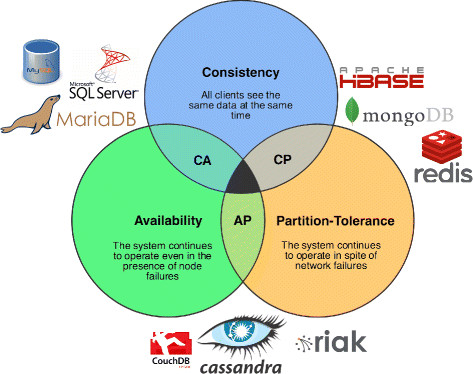

# Operational Data Storage

## Status
Accepted

## Context

Clearview System needs to store variety of data such as Candidate user profile, Employer profile, Job openings, Match information among others in databases. This data has to be stored adhering to functional and non functional requirements w.r.t read and write operations in the system. We need to identify type of Database system that can match these requirements.

### Alternatives

- RDBMS
- NoSQL

### PrOACT

| Criteria                       | RDBMS  | NoSQL | Requirement
| ------------------------------ | ------ | ----- | -----------
| Schema Flexibility             | Low    | High  |  Medium
| Scalability                    | Medium | High  |  Medium
| Availability                   | Medium | High  |  High
| Data Consistency               | High   | Low   |  High
| Write Performance              | Low    | High  |  Medium

## Decision

- The entities that are identified to be stored in database have strong relations in the form of foreign keys. For example, The job_match entity contains job opening id and candidate id, which are foreign keys from job opening and candidate id table respectively. It is essential that we maintain this relationship constraints to have high data integrity.
- All the clearview entities have clearly defined attributes and therefore, we can enforce relationship constraints, primary key constraints and data type constraints that come out of the box with rdbms.

## Tradeoffs

- Since we are developing a green field project, the schema could be changing in the beginning until the product attains market fit. In order to cater to that, we could have easier migration using popular migration tools.
- The third party HR system configuration can vary from one third party system to another, as different systems might have different integration requirements, therefore, we could go with a RDBMS that supports json data type such as postgres.

## Reference

- https://www.bmc.com/blogs/cap-theorem/#:~:text=The%20CAP%20theorem%20is%20a,or%20availability%E2%80%94but%20not%20both
