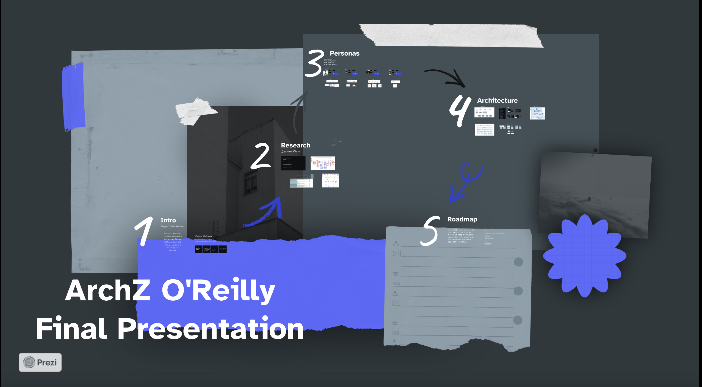

# O'reilly Architectural Katas - Fall 2024 - ClearView Platform

## Final Presentation

[Loom Link](https://www.loom.com/share/861dba6ac7da4ed286d002a76382671e)

[Prezi Link](https://prezi.com/view/NpsRHehM6pAnU8YZl3wz/)

## Table of Contents

- [O'reilly Architectural Katas - Fall 2024 - ClearView Platform](#oreilly-architectural-katas---fall-2024---clearview-platform)
  - [Final Presentation](#final-presentation)
  - [Table of Contents](#table-of-contents)
  - [About Team ArchZ](#about-team-archz)
  - [Glossary](#glossary)
  - [Prelude](#prelude)
    - [Goal of the platform](#goal-of-the-platform)
  - [Non-Functional Requirements](#non-functional-requirements)
  - [Overall Platform Context](#overall-platform-context)
  - [User experience](#user-experience)
    - [Candidate Golden Path](#candidate-golden-path)
    - [Employer Hiring manager Golden Path](#employer-hiring-manager-golden-path)
    - [Employer admin Golden Path](#employer-admin-golden-path)
    - [Platform Admin Golden Path](#platform-admin-golden-path)
  - [User Roles](#user-roles)
  - [Identifying Architectural Quanta](#identifying-architectural-quanta)
    - [Quanta](#quanta)
    - [Other Services](#other-services)
  - [Overall Architecture](#overall-architecture)
    - [Logical View](#logical-view)
    - [Physical View](#physical-view)
  - [Platform Roadmap](#platform-roadmap)
    - [MVP](#mvp)
    - [Long Term](#long-term)
  - [Engineering Best Practices references](#engineering-best-practices-references)

## About Team ArchZ

We are a passionate group of software engineers & designers from an innovation as a service organization [Zemoso](https://www.zemosolabs.com/).

Team members

- Saketh Kumar Kokonda
- Avinash Marepalli
- Srikanth Koraveni
- Prasad G
- Radha Agarwal

## Glossary

- HR System
- NFR - Non-functional requirement
- MVP - Minimum Viable Product
- PII - Personal Identifiable Information
- UI - User Interface
- UX - User Experience
- HM - Hiring manager
- BFF - Backend for frontend

## Prelude

ClearView is a supplemental HR platform that anonymizes candidate information while highlighting objective skills and qualifying experience to reduce bias in the hiring process. Clear View will also be service based, enabling DEI consultants to shadow employer interviews to rate the interviewer and report findings to executive management in an effort to proactively and strategically reduce bias in the interview process.

Diversity Cyber Council has come forward with a vision to enhance inclusion and representation in the tech industry through training, mentoring, networking, and visibility programs.

### Goal of the platform

To establish a sustainable and diverse talent pipeline that extends career equity to underrepresented demographics by providing access to competent training programs that lead to direct employment opportunities.

## Non-Functional Requirements

After the **[detailed analysis of business requirements](/business-requirements/requirement-analysis.md)**, the team has come up with the below NFRs for the platform

- Security
- Availability
- Scalability
- Configurabilty
- Performance
- Data Integrity
- Extendability

Since the proposal is a platform, the platform could be composed of several architectural quanta, each with its own architectural style. So, we are not picking a style yet.

## Overall Platform Context

[For better navigation on the content, use this miro frame](https://miro.com/app/board/uXjVLcJUnWk=/?moveToWidget=3458764600964960861&cot=14)

## User experience

The team went through a design thinking exercise to understand the Candidate, Employer and platform admin profiles, and empathize their needs and pain points. The following golden paths were considered:

[Design artifacts Figma link](https://www.figma.com/design/ConOZKBKzm6d2zft0nG8Ly/Final?node-id=0-1&t=hmu76myBUZbJCPay-1)

sample screens

[All screens](/ui-designs/)

### Candidate Golden Path

### Employer Hiring manager Golden Path

### Employer admin Golden Path

### Platform Admin Golden Path

## User Roles

- CANDIDATE
- EMPLOYER_ADMIN (associated with the respective Organisation)
- EMPLOYER_HM (associated with the respective Organisation)
- PLATFORM_ADMIN (associated with the ClearView Platform)

## Identifying Architectural Quanta

**Architecture quantum** - _An independently deployable artifact with high functional cohesion and synchronous connascence_

Quanta identification helps in defining different parts of the platform and the scope of architectural characteristics. We followed a mixture of event storming + actor-action approach to identify aggregates, components and quanta.

[Click here for more details on the exercise.](/assets/aggregate-quanta.jpg)

[Actor action event storming excercise](/assets/actor-action-event-storming.png)

For better navigation click [here](https://miro.com/app/board/uXjVLcJUnWk=/?moveToWidget=3458764601506325349&cot=14)

### Quanta

- [AI](/quanta/ai-quanta.md)
- [User Profile](./quanta/user-profile-quanta.md)
- [Matching](./quanta/matching-quanta.md)
- [Invoice](./quanta/invoice-quanta.md)
- [Notification](./quanta/notification-quanta.md)
- [Integrations](./quanta/integration-quanta.md)
- [Survey](./quanta/survey-quanta.md)
- [Analytics](./quanta/analytics-quanta.md)

### Other Services

- Infrastructure Services
- Support
- BFF

## Overall Architecture

### Logical View

### Physical View

[For better navigation on the content, use this [diagram](https://miro.com/app/board/uXjVLcJUnWk=/?moveToWidget=3458764601506371919&cot=14)]

## Platform Roadmap

### MVP

The MVP is envisioned to bring out the unique value proposition of the platform and solve the key business problem / pain points. It should be sufficient for the business to get market feedback and pivot, if needed.

Areas to be addressed (In the order of priority):

- User quanta
- Resume tips, anonymisation
- Resume matching and scoring
- External HR integration (1 or 2 popular ones)
- Admin analytics (No UI, just backend data)

### Long Term

Areas to be addressed:

- Survey
- Admin Analytics
- Configurable dashboards
- Notifications
- Configurable external HR systems
- Admin UI analytics dashboards

## Engineering Best Practices references

- [Continuous Delivery](https://www.atlassian.com/continuous-delivery/principles/continuous-integration-vs-delivery-vs-deployment)
- [Sidecar Pattern](https://dev.to/peterj/sidecar-container-pattern-314)
- [Twelve Factor App](https://12factor.net/)
- [Observability](https://cloud.ibm.com/docs/java?topic=cloud-native-observability-cn)